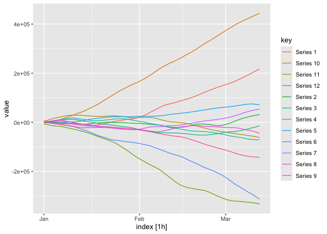
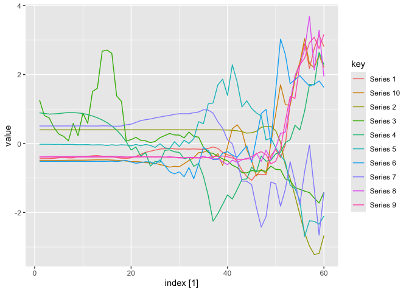

<!-- README.md is generated from README.Rmd. Please edit that file -->

# gratis 

<!-- badges: start -->

[](https://github.com/ykang/gratis/actions)
[](https://CRAN.R-project.org/package=gratis)
<!-- badges: end -->

The R package `gratis` (previously known as `tsgeneration`) provides
efficient algorithms for generating time series with diverse and
controllable characteristics.

## Installation

### [CRAN version](https://CRAN.R-project.org/package=gratis)

``` r
install.packages("gratis")
```

### Development version

You can install the **development** version of `gratis` package from
[GitHub Repository](https://github.com/ykang/gratis) with:

``` r
devtools::install_github("ykang/gratis")
```

## Usage

### Tutorial video

Watch [this YouTube video](https://www.youtube.com/watch?v=F3lWECtFa44)
provided by [Prof. Rob Hyndman](https://robjhyndman.com/).

### Load the package

``` r
library(gratis)
library(feasts)
```

### Generate diverse time series

``` r
set.seed(1)
mar_model(seasonal_periods=12) %>%
  generate(length=120, nseries=2) %>%
  autoplot(value)
```


### Generate mutiple seasonal time series

``` r
mar_model(seasonal_periods=c(24, 24*7)) %>%
  generate(length=24*7*10, nseries=12) %>%
  autoplot(value)
```



### Generate time series with controllable features

``` r
library(dplyr)
# Function to return spectral entropy, and ACF at lags 1 and 2
# given a numeric vector input
my_features <- function(y) {
  c(tsfeatures::entropy(y), acf = acf(y, plot = FALSE)$acf[2:3, 1, 1])
}
# Produce series with entropy = 0.5, ACF1 = 0.9 and ACF2 = 0.8
df <- generate_target(
  length = 60, feature_function = my_features, target = c(0.5, 0.9, 0.8)
)
df %>%
 as_tibble() %>%
 group_by(key) %>%
 summarise(value = my_features(value),
           feature=c("entropy","acf1", "acf2"),
           .groups = "drop")
#> # A tibble: 30 × 3
#>    key       value feature
#>    <chr>     <dbl> <chr>
#>  1 Series 1  0.533 entropy
#>  2 Series 1  0.850 acf1
#>  3 Series 1  0.735 acf2
#>  4 Series 10 0.478 entropy
#>  5 Series 10 0.880 acf1
#>  6 Series 10 0.764 acf2
#>  7 Series 2  0.507 entropy
#>  8 Series 2  0.890 acf1
#>  9 Series 2  0.899 acf2
#> 10 Series 3  0.454 entropy
#> # … with 20 more rows
autoplot(df)
```



### Web application

You can also run the time series generation procedure in a shiny app

``` r
app_gratis()
```

Or visit our [online Shiny
APP](https://ebsmonash.shinyapps.io/tsgeneration/)

## See also

-   R package `tsfeatures` from [GitHub
    Repository](https://github.com/robjhyndman/tsfeatures).

## References

-   Kang, Y., Hyndman, R., and Li, F. (2020). **GRATIS**:
    **G**ene**RA**ting **TI**me **S**eries with diverse and controllable
    characteristics. [Statistical Analysis and Data
    Mining](https://doi.org/10.1002/sam.11461).

## License

This package is free and open source software, licensed under GPL-3.

## Acknowledgements

Feng Li and Yanfei Kang are supported by the National Natural Science
Foundation of China (No. 11501587 and No. 11701022 respectively). Rob J
Hyndman is supported by the Australian Centre of Excellence in
Mathematical and Statistical Frontiers.
